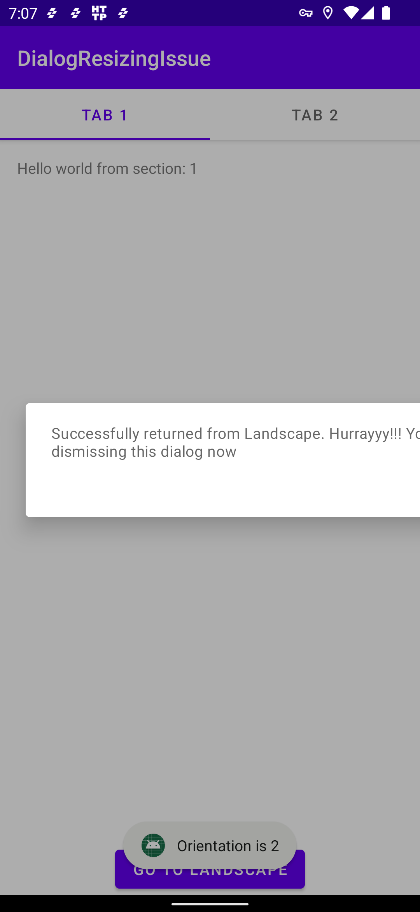

#### Lokalise - Dialog resizing issue when working with Compose

This issue started appearing from Jetpack Compose version `1.1.0-alpha05`. 

Upon debugging, we found the following:

1. This happens when the Lokalise SDK is used in conjuction with Jetpack Compose

2. This specific issue started appearing from Jetpack Compose version `1.1.0-alpha05`

3. This happens only when the orientation changes (Eg: Redirecting from Landscape Activity back to Portrait Activity)

###### Steps to reproduce

1. Attach `LokaliseContextWrapper` to a portrait `Activity`

2. Redirect now to an `Activity` with landscape orientation

3. Redirect back to portrait `Activity` . Now, try to show a `Dialog`. This dialog will appear stretched

The dialog's `Context` still has the  `orientation` landscape in it's `Resource` . This can be fixed by recreating the activity or further navigating back and coming back to the portrait screen again.
